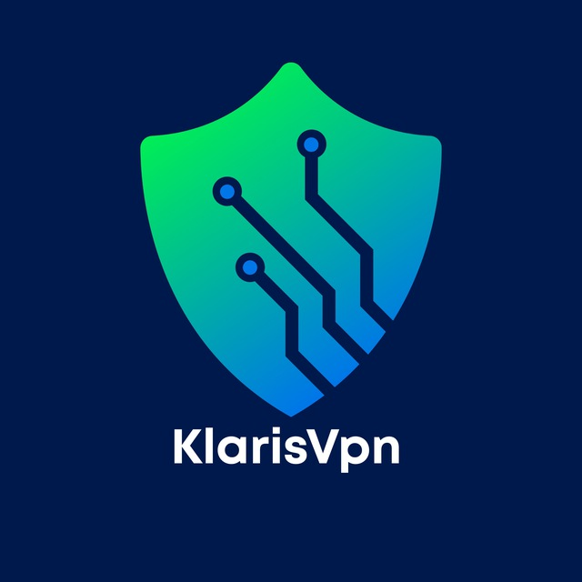

## 📚 Documentation

For complete API documentation, visit [here](https://todo.zmat24.ir/docs/api).

## 🤝 Contributing

We welcome your contributions to this project! Before submitting a Pull Request, please review the following guidelines:

1. Create an Issue first
2. Make your changes in a new branch
3. Keep your code clean and organized
4. Add necessary tests
5. Submit your Pull Request

## 💝 Sponsor

## 📞 Contact Us

- [Telegram](https://t.me/LearnWithZmat24)
- [YouTube](https://www.youtube.com/@matinsoleymani24)
- [GitHub](https://github.com/matinsoleymni)

## 📝 License

This project is licensed under the MIT License
